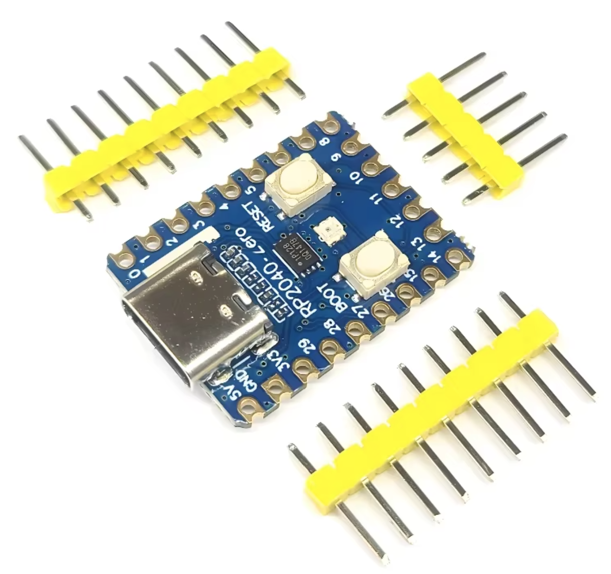
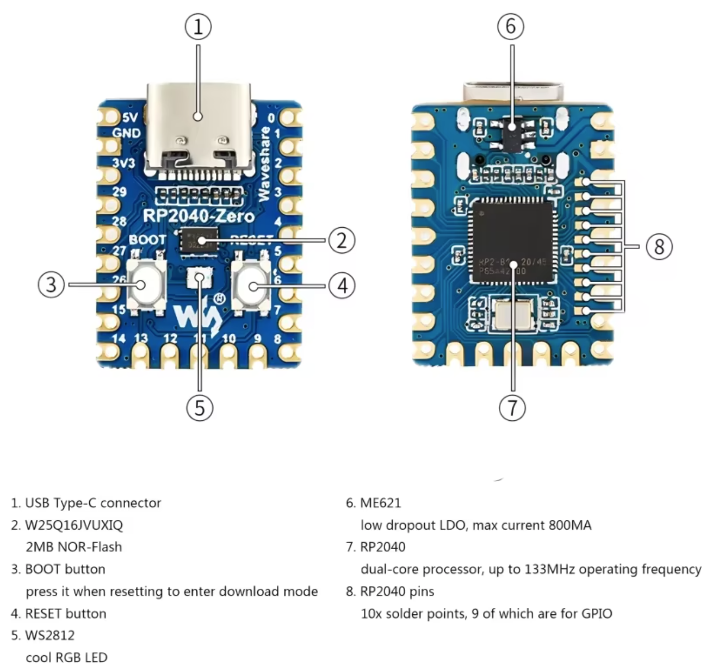
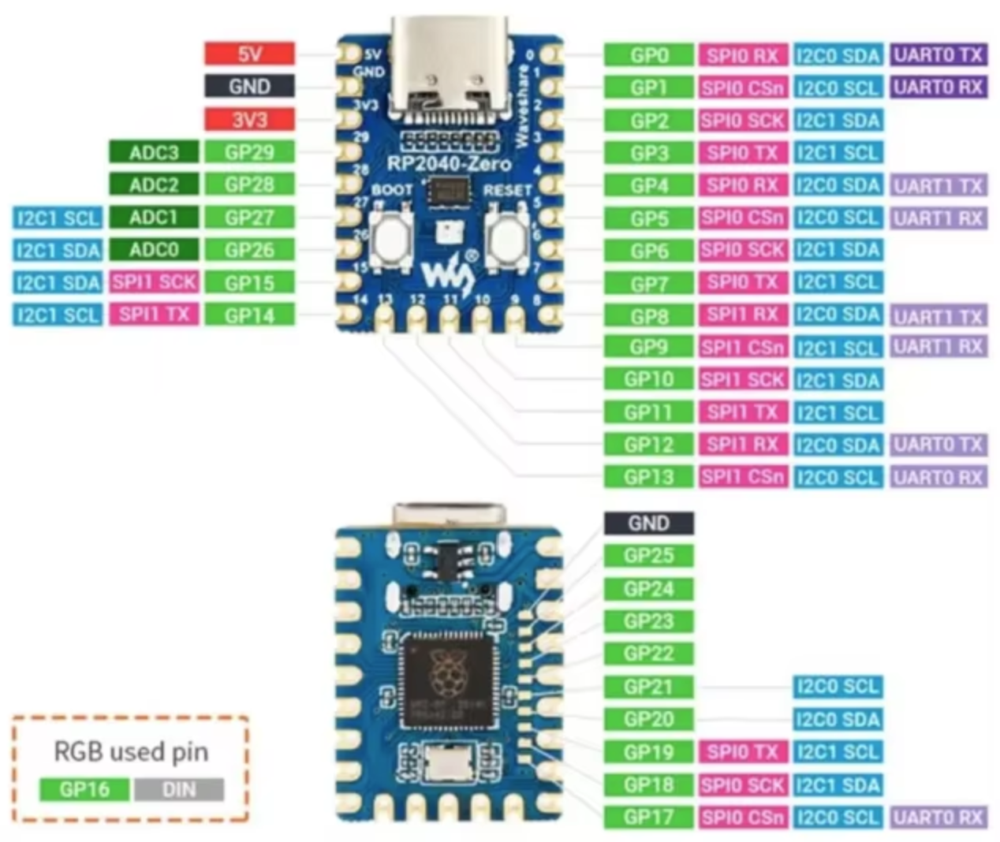

# RPi_Pico_WS2812_RGB_LED

Raspberry Pi Pico controlling RGB LED WS2812

## Hardware

Raspberry Pi Pico board with WS2812 RGB LED with serial communication interface
([example](https://www.aliexpress.us/item/3256807464011140.html)). \
RGB LED datasheet: https://cdn-shop.adafruit.com/datasheets/WS2812.pdf

## Software

The RGB LED on the board is connected to the Pico's GPIO pin 16. \
The parallel version of the code from the original Pico SDK example was removed. \
These are the only change that were made from the original Pico SDK example.

## Build

Install the official
[Raspberry Pi Pico Visual Studio Code](https://marketplace.visualstudio.com/items?itemName=raspberry-pi.raspberry-pi-pico)
extension for VSCode. Then open the project folder in VSCode and wait for the
extension to initialize itself. Then click on Compile at the bottom of the VSCode window.
Alternatively, click the Raspberry PI Pico Project icon in the Activity Bar on
the left side of VSCode window and click on Compile Project. You'll find a new
file pio_ws2812.uf2 in bhe build directory. This is the firmware that will be
loaded onto the Pico board.

Note: If you delete the build directory, the regular build process might fail. In
that case, restart VSCode or reopen the project, and this should fix the problem.

## Usage

Connect the Pico board to your computer via USB. The Pico will appear as a
USB drive. If it doesn't, press both the reset and boot buttons simultaneously,
then release the reset button while holding the boot button. A new drive should
appear. Release the boot button. Then copy the pio_ws2812.uf2 file onto the
Pico drive. The FW image will be loaded automatically onto the Pico board, the
Pico will reboot itself, and the RGB LED will start blinking various color
patterns.
